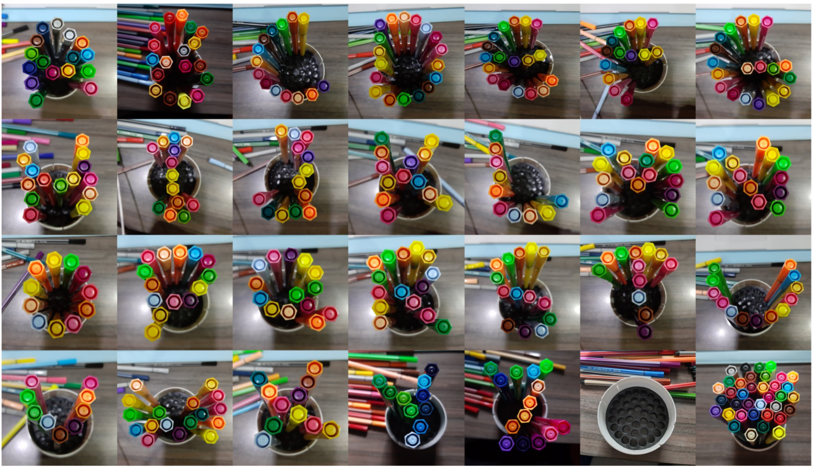
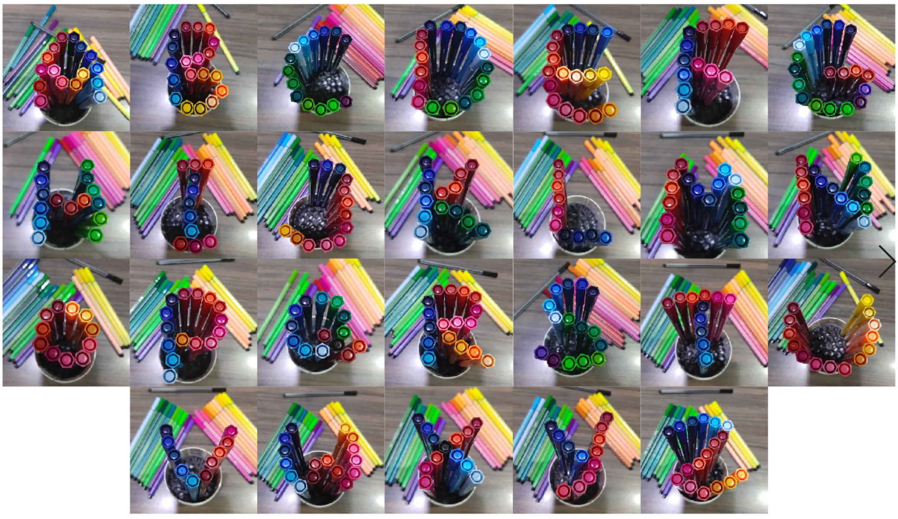

# A to the K - SKO
## Contextualise
A to the K Computational Typography studio aims to explore and engage with the field of computational language and typography. This is a rapid changing world, as we advance more in the digital world of computers and phones, understanding and utilising techniques in computational coding makes this studio a dynamic and necessary discipline to must engage in. Computational typography is the future development of typography, in the exploration and expansion of modularity and variability, typography is becoming more diverse and out there. With the incorporation of computational programming, ideas are becoming more creative, the assistance of computational elements allow typography to become individual and stand on its own. As a designer, knowing how to code is essential in future practices, being conscious of the changes in design and society is impactful and a necessity, to effectively communicate and engage with others and advance the perception of typography and design.

A to the K studio explored step and step of typography design, not rushing straight into the production of computations and programming. Take a step back and explore what is in front of us in the present, to understand typography and systems, through first physically exploring with our hands of real objects. To understand that typography requires standardisation and systematic approaches, as computation and programming often require logical and systematic representation. Although, through this studio I haven’t become a professional in coding and typography, but it has broadened my skills and understanding of typography, which will become handy and take into consideration in future design projects, or potentially open me more into the world of programming and coding. 

## Reflect 
Undertaking the A to the K studio has been an extremely engaging and beneficial experience for my practice whether outside or inside of design. Coding is a beneficial, and I believe will be a major skill set for practicing in the field of design in the future. As technology advances and broadens the uses and potential of computation in various field of work, design is also being expanded and placed more on technological mediums and platforms. Knowing how to code can expand ones skill set to showcase to clients and broaden the depth of design projects. During the course of this studio, my depth of understanding in coding has expanded and become less terrified of the idea of coding and computational design. By opening my mind to coding, design has become more motion and moveable in comparison to solidified and constant print designs. It has allowed many of my ideas to come to light and given me a new tool set to explore more variations in my future design projects. Using motion and interaction draws people to engage and fully immerse in the design, when users interact with the medium, they not only have fun but also absorb the information designers want to communicate. By creating an interactive space for the user, the engagement of users and information absorption increases, and more information can be communicated. As technology advances and change occurs so often now, the attention spans of people have dropped and people know often rely on more technological approaches to retrieve information and knowledge. By establishing a fun and engaging way to capture people’s attention is becoming much more easier with interactive technology and interactive design. 

Before going straight into coding and computational typography, we took a step back and went into developing typography first by scratch and using physical objects. Using only one element to form twenty six glyphs, where the typeface has to have a system or set of standardisation so that if someone else was to replicate it a set of rules were to bind the glyphs together into one. This step back was important because it gave me the chance to step back and have a background experience before diving straight into coding. Having this chance, it clarified and solidified the element of system and standardisation. Initially, it seemed quite chill and fun to go around and find objects to build letters out of, until I realised not all letters can fit into the system. When that happened, the system had to be altered and adjusted so that the rules can fulfill all twenty six glyphs. From experimenting and being able to physically change the objects around made the process both frustrating but also therapeutic. Once the rule was established it was just a matter of moving, adding and removing pieces. But while establishing rules, the system also can not be too broad, having the system too broad can sometimes make it seem like there is no rule of standardisation. Initially for my texta placements I had just the amount of textas used as the main set of rule that even if some aren’t used it still needs to be in the frame, however, the end result seemed really messy and inconsistent using different colours. Therefore, more rules needed to be set and a clearer set of standardising was needed. This made me realise that taking a step back and understanding the basics before jumping into the deep end is important, and typography really requires standardisation and systematic approaches. From creation both letting go and exploring a wide range of creative modules is important but also bringing it back, taking it step by step and restraining ourselves to design a system and to stick with. 

         

Personally, through this studio an important insight is the need to stay patient and pay attention to detail. Especially in the process of coding, paying attention and being precise with the right codes and spelling is essential to make the code work. Having the hour of code, really benefited my learning and understanding of coding, I initially was terrified of coding as I had never done it before and the concept of it just confused me especially the computational language. But through the hour of code every week, it really relieved my terror towards coding and it made me more engaged and interested in coding. Throughout the process of coding, being alert and precise with the coding language is extremely important for the line of code to work. In coding, the most annoying thing is when I run the code and the page continues loading and loading, that’s when I knew something was not right. Having to go through the entire code line by line really tests your patience, especially when it’s the smallest thing missing, and sometimes I don’t register the mistake. For example, when loading a font, I kept looking at the coding and thinking I didn’t save or drag the font in or something in my draw function was missing but it turned out I forgot to use a capital f for loadFont. As my understanding of coding grew and my interest deepened, though this studio I realised that patience and attention to detail is just as important as the design itself. Even if the design is magnificent, not having the patience to slowly piece it together and mould it, it won’t be born and shown. In the design practice, nothing is just going to appear once you think of it, step by step production is needed to actually curate and build it, through this studio it has solidified my understanding in code and design mindset. 

## Propose 
Through the A to the K studio I have deepened my understanding of computational design in general, and to incorporate system with out of the world creativity. From a coding blank, literally knew nothing whatsoever and being afraid of coding, to somewhat understanding and occasionally having fun with coding. My understanding of systemisation and logicality, to have a broad concept and system and develop from within the restrains, and although not everything works within the system but learning to think and alter, pushing the limits, but still fits in and comes together. Being challenged to create a guide and system which can sustain and account for twenty six glyphs is definitely harder than imagined. I have come to understand the importance to have a solid backbone and concept to a design, a backbone that can be taken further and be broad enough to take into account different mediums and modules in a design project. From the production and exploration of coding for the first time, patience is definitely the key and keep a calm, relaxed mood. Coding can for sure mess with you when even the slightest mishap can mess up the result. Knowing to stay calm and be precise and alert has made my understand and grow as a designer, not only as a designer but also as a person. I will continue to explore and expand my understanding of coding and the advancement of computation in typography. Being able to have system and strategy to support a design and to not restrict myself by establishing a small backbone. I will concentrate on being mindful of back strategy and plans and more importantly to not rush into something, be patient and precise.  
